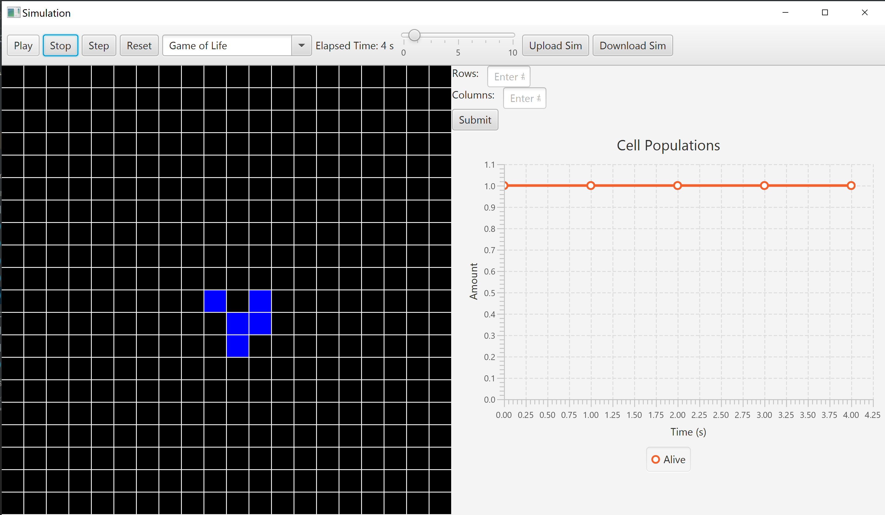

simulation
====

This project implements a cellular automata simulator.

Language: Java. Frameworks: OpenJFX

Names: Chris Warren, Shruthi Kumar, Aneesh Gupta

### Timeline

Start Date: 01-25-2020

Finish Date: 02-09-2020

Hours Spent: 20+ hours per person.

### Primary Roles
1. Aneesh Gupta: Writing _Configuration_ part and package, reading in things from XML files, creating Grid objects and populating them based on this. Also helped with some visualization components like uploading new simulations, downloading current state, resetting them, and two-pass update for the Grid class.

2. Shruthi Kumar: Backend side writing the complete implementations for all the Cell classes/subclasses, wrote the grid class, wrote the Neighbor class and corresponding subclasses, worked on setting up the UI anchorpane to hold different cell shapes

3. Chris Warren: Front end/UI, displaying the simulation as well as adding functionality for all the buttons and inputs, running the simulation and updating it. everything in the view folder. Also helped with some logic of the grid.

### Resources Used
1. Class and Lab code: [Spike Simulation](https://coursework.cs.duke.edu/compsci308_2020spring/spike_simulation)
2. StackOverflow and Oracle Java documentation
3. XMLWrite [example](https://examples.javacodegeeks.com/core-java/xml/parsers/documentbuilderfactory/create-xml-file-in-java-using-dom-parser-example/)
4. Hexagon grid: https://www.redblobgames.com/grids/hexagons/
5. https://www.youtube.com/watch?v=ncRA1OAbMmk&t=1197s

### Running the Program

#### Main class: 
`src/cellsociety/Main.java` or `src/cellsociety/view/Display.java` (both run the program)

#### Data files needed: 
XML Files housed in `simulation_team03/data`: These house the simulations, the error files, and the saved (downloaded) simulations. New simulations can be added here.

#### Features implemented:
- Configuration:
  1. Reads in XML files. There are two options: either you select easy-access, default files, or open up your file explorer and upload one of your own choice.
  2. Catches errors and exceptions in XML files, and does not let bad XML files to be fed in (for egs. go to `data/ErrorFiles`):
     1. Empty/Missing fields: `allEmpty.xml`
     2. Incorrect datatype: `invalidDataType.xml`
     3. Negative values/values out of bounds: `negativeValues.xml`
     4. Out of bounds: Sets default values.
  3. Allow simulation's initial configuration to be set by:
     1. A list of specific locations and states specified in file.
     2. Completely randomly based on a total number of locations to occupy
     3. You can load in saved simulations.
  4. Allow users to save the simulation's current state in an XML file by clicking a button.
     1. These files are saved under `data/savedFiles`.
     2. Contain parameters such as name, author, size, shape.
     3. Also contain an exact map of the saved simulation's cells states.
     4. You can load in these to save and later resume a simulation.
  5. You can specify characteristics of the simulation through such files, eg.:
     1. Size of grid.
     2. Shape of cells to be used.
     3. Type of simulation to be run.
     4. States of specific cells.
     
- Model:
    1. Grid class 
        1. initializes the grid that holds and displays the cells and their states
        2. Uses a two pass feature in the updateCell method to update new states without overwriting old states
        3. Uses overloaded constructors to cater to multiple simulations
        4. Initializes cell states in grid based on layout or randomly
    2. Cell Classes
        1. Uses inheritance and polymorphism to create a grid of cells
        2. All cells are able to do things like get their neighbors and check their current/next states
        3. Extendable cell subclassses implement their own set of rules
        4. Implements the basic simulations (Game of Life, Segregation, Percolation, WaTor, Fire)
        5. Added extra simulations (RPS and SugarScape)
    3. Neighbor classes
        1. Allows users to change shapes of the cells (square, triangle, hexagon)
        2. Uses inheritance and abstract neighbor superclass to hold abstract methods
        3. Each subclass has its own way of checking for neighbors based on how many they have
- Visualization:
    1. Mainview
        1. Borderpane that holds the toolbar, grid and config panel
        2. Updates the game and determines the shape of the panels.
    2. Configpanel
        1. Vbox holding more UI features
        2. Includes the graph
        3. Includes the input fields to change the number of rows and columns as well as a submit button to update the simulation
    3. Display
        1. Displays the Mainview Borderpane on a stage
        2. Allows users to upload a file corresponding to a simulation
        3. Displays error message if wrong format is uploaded
    4. Toolbar
        1. Vbox that includes most of the functionality for the simulations
        2. Start/Pause button to stop and start the simulation.
        3. Step button to iterate through the simulation one step at a time
        4. Reset button to reset to the original state of the sumulation
        5. Dropdown menu to choose which simulation to play
        6. Elapsed time display to display the amount of time elapsed over the course of the simulationa nd it is based on the speed of
            the iterations. Resets along with any resets to the simulation
        7. Upload and save file button to upload a file into the simulation and to save a current instance of a simulation to an xml file.
        8. Slider to change the speed of the simulation.
      

### Notes/Assumptions

Assumptions or Simplifications:
- Once a file is desired to be uploaded, you should not close the file browsing window.
- Cell shapes are inputs through XML files.
- For a simulation to run correctly, clean, and correct XML files must be passed in.
- We just created mix-and-match shape and simulation pairings to show that we can diversify this, and create all possible combinations.

Interesting data files: 
- `simulation_team03/data/gameOfLifeLayout.xml`: Represents a preset states and layout file
- `simulation_team03/data/predator.xml`: Randomly generated states file
- Files under `simulation_team03/data/ErrorFiles/`, eg.:
  - `invalidDataType.xml`: Invalid data type, such as string instead of number
  - `allEmpty.xml`: Missing fields
  - `incorrectChoice.xml`: Choice of simulation is not in bounds, so default to Game of Life simulation.
- Files under `simulation_team03/data/savedFiles/`, eg.:
  - `GameOfLife_saved.xml`: represents a simulation state downloaded from between the program, allowing users to save the state of the simulation they are seeing on the screen.

Known Bugs:
- Not a bug, but closing the file explorer once it is opened can cause program to shut down. Therefore, you must always choose a file if you have opened the file explorer.
- SugarScape simulation not completely robust when it comes to update logic (the rules seem to be wrong as the agents just die off and don't maintain their population count)

Extra credit:
- Writing to XML file the current state of the program.
- Being able to load in specific states and locations for cells through configuration.
- Error and exception handling.
- Implement and update grid states according to rules of simulation.
- Many different types of Simulations and rules: _Game of Life, Percolation, Fire, Predator-Prey, Segregation, Rock-Paper-Scissors_ and _SugarScape_.
- Different types of cell shapes: Square, Triangle, and Neighbours.
- UI Features to show time, reset, stop, upload new, step through, etc.
- Architecture in place to interact with CA through custom UI inputs, clicks etc.
- Can easily add more UI elements, such as graph to monitor progress of CA simulation. Basic graph implementation is there, but it doesn't update the number of cells

### Impressions
- Assignment had many different moving parts.
- Even though M-V-C model provides a good amount of separation and blocks, it is still hard at times to integrate them
together and join pipelines between different components.
- Important, and sometimes hard to keep track of all the repercussions and trace-effects of any small change.
- One thing we did notice but didn't know how to fix is one set of chained if statements in the Grid class. This happens when we 
use the getSimulation method, but its used in multiple other places and we needed to pass in the state variables so we didn't know 
how to avoid using the if statements here. We made sure to avoid them elsewhere. 

### Screenshot
Game of Life: Glider layout

